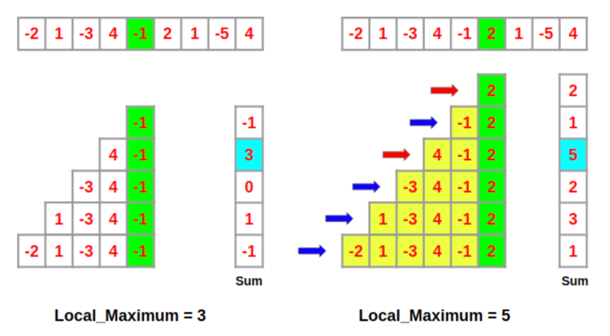

# Maximum contiguous sub-array
* Naive / Brute force - O(n<sup>2</sup>)
    *  The brute force algo starts from the left end to the right end, check every possible sub-array that contains A[I].
    
* Divide and conquer, recursive - O(nlgn)

* Kadane's algorithm(1982), recursive, greedy - O(n)


The <u>**original requirement**</u> for Kadane's algorithm is that Your array must have at least one positive number.

The <u>**original idea**</u> of Kadane's algorithm is greedy, a maximum sub-array should be positive. Therefore, if our sum is negative, it is meaningless to consider it as a part of the maximum sub-array. So, we determine index I by tracking the sum to see whether it is negative or positive.

for example, if we have

1000, -1, -2, …, more negative elements, …, -3, 1, 2000, …

then the largest subarray will only start at 1000, if the sum of all the intermediate results is greater than -1000. 
If the sum is < 1, we should start with 1.

Let's think deeper, 我们关注从右向左，关注每个包括A[ j ]的sub-array，并用一个tracker记录最大的sub-array，当j从n->1遍历后，即可找到the max sub-array.

包括A[ j ]的max sub-array = 包含A[ j - 1 ]的max sub-array + A[ j ] 或者 A[ j ]自己。



Why？可以理解为当包含A[ j - 1 ]的max sub-array对A[j]是负增益时，那我就还不如不要这段负增益，此时，包括j元素的max sub-array就是A[ j ].所以当你从右向左遍历时，这也是确定i的方法。

Now we know what the (potential) starting point I of a maximum subarray looks like: it’s a value that is greater than the sum all previous elements. we can write the recurrence.

```current_sum = max(x, current_sum + x) ```
        
It compares starting at x, with starting someplace in the past and including all the elements from that point forward. With this recurrence we can break the origin limit.

Overall, Kadane's algorithm is an amazing greedy algorithm which starts from the right to the left.